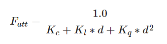

到这里就已经通过入门阶段，接下来进入光照阶段。 
# 颜色
现实中我们所看到的颜色是反射的颜色。  
当有光源时，比如白色的光源，照在一个蓝色的物体上时，我们所看到的是，两种颜色值相乘的结果，在计算机图形学中：  
glm::vec3 lightColor(1.0f, 1.0f, 1.0f);  
glm::vec3 toyColor(1.0f, 0.5f, 0.31f);  
glm::vec3 result = lightColor * toyColor; // = (1.0f, 0.5f, 0.31f);  
是这样计算的。  
## 创建一个光照场景
因为我们还要创建一个表示灯（光源）的立方体，所以我们还要为这个灯创建一个专门的VAO。当然我们也可以让这个灯和其它物体使用同一个VAO，简单地对它的模型矩阵做一些变换就好了，然而接下来我们会频繁地对顶点数据和属性指针做出修改，我们并不想让这些修改影响到灯，因此我们有必要为灯创建一个新的VAO。  
主要做的改变是单独为光源（这里是一个立方体）设置了顶点着色器和片段着色器，这样区分开来比较方便和清晰。这也能帮助我们更进一步了解渲染的流程。  
# 基础光照
现实中光照很复杂，因此我们使用的是OpenGL中的简化模型，其中一种是风氏光照模型，风氏光照模型的主要结构由3个分量组成：环境(Ambient)、漫反射(Diffuse)和镜面(Specular)光照。  
  
## 环境光照
光能够不停的在物体上进行反射，可以到达几乎所有地方，这叫做全局照明，但是过于复杂，我们目前先使用简化模型，即环境光照。  
把环境光照添加到场景里非常简单。我们用光的颜色乘以一个很小的常量环境因子，再乘以物体的颜色，然后将最终结果作为片段的颜色。
这里常量环境因子使用0.1：  
   
## 漫反射光照
漫反射光照使物体上与光线方向越接近的片段能从光源处获得更多的亮度：  
   
为了测量光线和片段的角度，我们使用一个叫做法向量(Normal Vector)的东西，它是垂直于片段表面的一个向量（这里以黄色箭头表示）。  
法向量是一个垂直于顶点表面的（单位）向量。由于顶点本身并没有表面（它只是空间中一个独立的点），我们利用它周围的顶点来计算出这个顶点的表面。我们能够使用一个小技巧，使用叉乘对立方体所有的顶点计算法向量，但是由于3D立方体不是一个复杂的形状，所以我们可以简单地把法线数据手工添加到顶点数据中。由于我们向顶点数组添加了额外的数据（新属性），所以我们应该更新光照的顶点着色器。    
## 镜面光照
想象一下，一个光源照向镜子上，其中有光、镜子和眼睛的位置，就是镜面反射的概念，这里需要两个向量：光的反射方向、人眼的观察方向，其中光的反射方向可以通过光的入射方向和法线计算得出，人眼的观察方向可以直接通过位置算出，而射向眼睛的光可以通过这两个向量以及镜面强度和高光的反光度还有光的颜色求出。  
  
最后光照这一块总结一下：首先设置一个场景，有一个光源和一个物体，对于光源，使用和物体一样的顶点数据，即VBO一样，不过属性不同，即VAO不同，眼睛观察到的物体是通过物体本身颜色以及光照颜色所复合而成，而光照又包括三种，即环境光照、漫反射光照、镜面光照，环境光照只需要一个常量环境因子，漫反射光照由光照反方向和物体法线向量点乘得到diff，镜面光照则比较通俗易懂，需要光的反射方向和观察方向求出。  
对于上述模型，注意向量在使用时需要标准化，光源的模型目前比较简单，使用的是一个点光源，物体模型也比较简单，因此法向量可直接得到（以后则需要另外求出）。  
在物体的着色器中，有顶点位置和法向量两个属性，需要从顶点着色器传输顶点的世界坐标和法向量给片段着色器使用，在片段着色器中则需要使用到这两个数据并另外通过uniform获得摄像机的位置坐标，求出三种光照信息，最终得到更加真实的显示效果。  
  
# 材质
在现实世界里，每个物体会对光产生不同的反应。比如，钢制物体看起来通常会比陶土花瓶更闪闪发光，一个木头箱子也不会与一个钢制箱子反射同样程度的光。有些物体反射光的时候不会有太多的散射(Scatter)，因而产生较小的高光点，而有些物体则会散射很多，产生一个有着更大半径的高光点。如果我们想要在OpenGL中模拟多种类型的物体，我们必须针对每种表面定义不同的材质(Material)属性。  
我们已经为三个光照分量定义一个材质颜色(Material Color)：环境光照(Ambient Lighting)、漫反射光照(Diffuse Lighting)和镜面光照(Specular Lighting)。通过为每个分量指定一个颜色，我们就能够对表面的颜色输出有细粒度的控制了。现在，我们再添加一个反光度(Shininess)分量，结合上述的三个颜色，我们就有了全部所需的材质属性了。  
ambient材质向量定义了在环境光照下这个表面反射的是什么颜色，通常与表面的颜色相同。diffuse材质向量定义了在漫反射光照下表面的颜色。漫反射颜色（和环境光照一样）也被设置为我们期望的物体颜色。specular材质向量设置的是表面上镜面高光的颜色（或者甚至可能反映一个特定表面的颜色）。最后，shininess影响镜面高光的散射/半径。  
在片段着色器中，我们创建一个结构体(Struct)来储存物体的材质属性。使用uniform来访问material。  
目前光源只有颜色和位置，而没有另外设置强度，因此我们也创建一个结构体存储光源的属性。对于不同的反射我们希望光的强度有所区分。  

# 光照贴图
现实中的物体上会有很多种材质，上面的材质系统是肯定不够的，它只是一个最简单的模型，我们需要拓展它，引入漫反射和镜面光贴图(Map)。这允许我们对物体的漫反射分量和镜面光分量有着更精确的控制。  
## 漫反射贴图
我们希望通过某种方式对物体的每个片段单独设置漫反射颜色。这听起来很像之前的纹理，而这基本就是这样：一个纹理。我们仅仅是对同样的原理使用了不同的名字：其实都是使用一张覆盖物体的图像，让我们能够逐片段索引其独立的颜色值。在光照场景中，它通常叫做一个漫反射贴图(Diffuse Map)，它是一个表现了物体所有的漫反射颜色的纹理图像。  
在着色器中使用漫反射贴图的方法和纹理教程中是完全一样的。但这次我们会将纹理储存为Material结构体中的一个sampler2D。我们将之前定义的vec3漫反射颜色向量替换为漫反射贴图。我们也移除了环境光材质颜色向量，因为环境光颜色在几乎所有情况下都等于漫反射颜色，所以我们不需要将它们分开储存。   
## 镜面光贴图
对于不同材质，镜面光照应该有明显的区分。镜面高光的强度可以通过图像每个像素的亮度来获取。镜面光贴图上的每个像素都可以由一个颜色向量来表示，比如说黑色代表颜色向量vec3(0.0)，灰色代表颜色向量vec3(0.5)。在片段着色器中，我们接下来会取样对应的颜色值并将它乘以光源的镜面强度。一个像素越「白」，乘积就会越大，物体的镜面光分量就会越亮。  
由于箱子大部分都由木头所组成，而且木头材质应该没有镜面高光，所以漫反射纹理的整个木头部分全部都转换成了黑色。箱子钢制边框的镜面光强度是有细微变化的，钢铁本身会比较容易受到镜面高光的影响，而裂缝则不会。  
由于我们正在同一个片段着色器中使用另一个纹理采样器，我们必须要对镜面光贴图使用一个不同的纹理单元。  
光照贴图总结：可以理解为引入贴图，然后在贴图上实现光照，这里纹理的使用包括：纹理属性、纹理加载封装、uniform传递ID、渲染时激活。在进行不同材质的光照区分时，使用了多个纹理分别处理漫反射和镜面反射，对整体的贴图进行漫反射，对一些镜面反射明显的材质（比如钢）进行镜面反射。  
  
练习题  
1. 让木头显示镜面高光而钢制边缘不反光
vec3 specular = light.specular * spec * (vec3(1.0) - vec3(texture(material.specular, TexCoords)));在镜面光照中使用这个，让白变黑、黑变白。  
2. 添加一个叫做放射光贴图(Emission Map)的东西，它是一个储存了每个片段的发光值(Emission Value)的贴图。发光值是一个包含（假设）光源的物体发光(Emit)时可能显现的颜色，这样的话物体就能够忽略光照条件进行发光(Glow)。游戏中某个物体在发光的时候，你通常看到的就是放射光贴图（比如 机器人的眼，或是箱子上的灯带）。将这个纹理（作者为 creativesam）作为放射光贴图添加到箱子上，产生这些字母都在发光的效果。
增加了一种“反射光”放射光，通过一个新的纹理显示出来。这里另外控制纹理中的颜色位移，产生放射光移动的效果。
  
# 投光物
将光投射(Cast)到物体的光源叫做投光物(Light Caster)。在这里我们将会讨论几种不同类型的投光物。学会模拟不同种类的光源是又一个能够进一步丰富场景的工具。  
## 定向光：平行光
当一个光源处于很远的地方时，来自光源的每条光线就会近似于互相平行。不论物体和/或者观察者的位置，看起来好像所有的光都来自于同一个方向。当我们使用一个假设光源处于无限远处的模型时，它就被称为定向光，因为它的所有光线都有着相同的方向，它与光源的位置是没有关系的。比如太阳。  
## 点光源
点光源是处于世界中某一个位置的光源，它会朝着所有方向发光，但光线会随着距离逐渐衰减。想象作为投光物的灯泡和火把，它们都是点光源。之前我们定义的是简化点光源（光强不变）。  
衰减：随着光线传播距离的增长逐渐削减光的强度通常叫做衰减(Attenuation)。随距离减少光强度的一种方式是使用一个线性方程。  
  
在这里d代表了片段距光源的距离,接下来为了计算衰减值，我们定义3个（可配置的）项：常数项Kc、一次项Kl和二次项Kq。  
常数项通常保持为1.0，它的主要作用是保证分母永远不会比1小，否则的话在某些距离上它反而会增加强度，这肯定不是我们想要的效果。  
一次项会与距离值相乘，以线性的方式减少强度。  
二次项会与距离的平方相乘，让光源以二次递减的方式减少强度。二次项在距离比较小的时候影响会比一次项小很多，但当距离值比较大的时候它就会比一次项更大了。  
该对这三个项设置什么值呢？正确地设定它们的值取决于很多因素：环境、希望光覆盖的距离、光的类型等。在大多数情况下，这都是经验的问题，以及适量的调整。
https://wiki.ogre3d.org/tiki-index.php?page=-Point+Light+Attenuation  
这个网站提供了不同覆盖半径的三个值。  
## 聚光
聚光是位于环境中某个位置的光源，它只朝一个特定方向而不是所有方向照射光线。这样的结果就是只有在聚光方向的特定半径内的物体才会被照亮，其它的物体都会保持黑暗。聚光很好的例子就是路灯或手电筒。  
OpenGL中聚光是用一个世界空间位置、一个方向和一个切光角(Cutoff Angle)来表示的，切光角指定了聚光的半径（译注：是圆锥的半径不是距光源距离那个半径）。对于每个片段，我们会计算片段是否位于聚光的切光方向之间（也就是在锥形内），如果是的话，我们就会相应地照亮片段。
  
手电筒：手电筒(Flashlight)是一个位于观察者位置的聚光，通常它都会瞄准玩家视角的正前方。基本上说，手电筒就是普通的聚光，但它的位置和方向会随着玩家的位置和朝向不断更新。  
