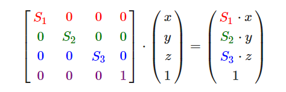
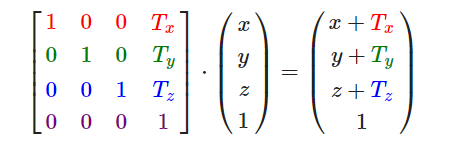

# 变换
前置知识：向量运算（向量和标量运算、取反、向量加减、向量长度、点乘、叉乘*）、矩阵运算（加减、数乘、矩阵相乘、矩阵乘向量、单位矩阵）  
## 缩放
  
## 位移
  
向量的w分量也叫齐次坐标,通常为1.0，为0时该向量无法位移。  
##  旋转
有沿着x、y、z轴旋转的运算，不过会有万向节死锁的问题，这里我们采用四元数解决这个问题。  
## 组合变换
上述变换可以通过矩阵相乘进行组合变换，在组合变换中顺序很重要，注意矩阵运算顺序就行（先右后左）。  
  
OpenGL自身没有矩阵运算的库，这里我们引入数学库GLM。将glm文件放入我们的include中，下载地址：https://github.com/g-truc/glm    
  
# 实践
在顶点着色器中定义uniform mat4的矩阵用于变换，在程序渲染时也定义一个mat4，并进行矩阵变换，这里使用了位移和旋转（随时间变化），通过uniform的相关函数进行修改，实现矩阵变换。  
