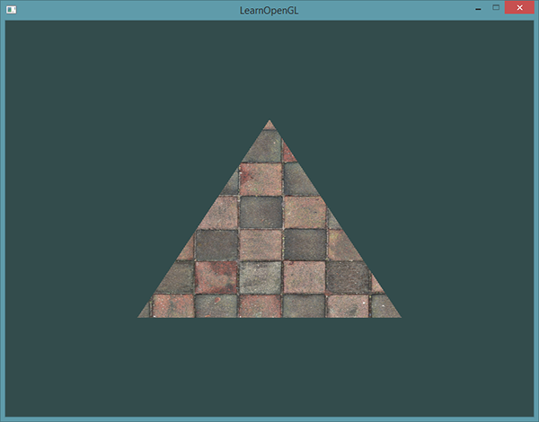

# 纹理
如果想让图形看起来更真实，我们就必须有足够多的顶点，从而指定足够多的颜色。这将会产生很多额外开销，因为每个模型都会需求更多的顶点，每个顶点又需求一个颜色属性。  
因此需要使用到纹理，纹理是一个2D图片（甚至也有1D和3D的纹理），它可以用来添加物体的细节；你可以想象纹理是一张绘有砖块的纸，无缝折叠贴合到你的3D的房子上，这样你的房子看起来就像有砖墙外表了。因为我们可以在一张图片上插入非常多的细节，这样就可以让物体非常精细而不用指定额外的顶点。  
    
为了能够把纹理映射(Map)到三角形上，我们需要指定三角形的每个顶点各自对应纹理的哪个部分。这样每个顶点就会关联着一个纹理坐标(Texture Coordinate)，用来标明该从纹理图像的哪个部分采样（译注：采集片段颜色）。之后在图形的其它片段上进行片段插值(Fragment Interpolation)。  
纹理坐标在x和y轴上，范围为0到1之间（注意我们使用的是2D纹理图像）。使用纹理坐标获取纹理颜色叫做采样(Sampling)。纹理坐标起始于(0, 0)，也就是纹理图片的左下角，终止于(1, 1)，即纹理图片的右上角。下面的图片展示了我们是如何把纹理坐标映射到三角形上的。  
  
我们为三角形指定了3个纹理坐标点。如上图所示，我们希望三角形的左下角对应纹理的左下角，因此我们把三角形左下角顶点的纹理坐标设置为(0, 0)；同理右下方的顶点设置为(1, 0)；三角形的上顶点对应于图片的上中位置所以我们把它的纹理坐标设置为(0.5, 1.0)。我们只要给顶点着色器传递这三个纹理坐标就行了，接下来它们会被传到片段着色器中，它会为每个片段进行纹理坐标的插值。  
float texCoords[] = {  
    0.0f, 0.0f, // 左下角  
    1.0f, 0.0f, // 右下角  
    0.5f, 1.0f  // 上中  
};  
对纹理采样的解释非常宽松，它可以采用几种不同的插值方式。所以我们需要自己告诉OpenGL该怎样对纹理采样。   
环绕方式	         描述  
GL_REPEAT	        对纹理的默认行为。重复纹理图像。  
GL_MIRRORED_REPEAT	和GL_REPEAT一样，但每次重复图片是镜像放置的。  
GL_CLAMP_TO_EDGE	纹理坐标会被约束在0到1之间，超出的部分会重复纹理坐标的边缘，产生一种边缘被拉伸的效果。  
GL_CLAMP_TO_BORDER	超出的坐标为用户指定的边缘颜色。  
纹理过滤：邻近过滤、线性过滤。  
当进行放大(Magnify)和缩小(Minify)操作的时候可以设置纹理过滤的选项，比如你可以在纹理被缩小的时候使用邻近过滤，被放大时使用线性过滤。  
使用glTexParameter*函数为放大和缩小指定过滤方式。  
glTexParameteri(GL_TEXTURE_2D, GL_TEXTURE_MIN_FILTER, GL_NEAREST);  
glTexParameteri(GL_TEXTURE_2D, GL_TEXTURE_MAG_FILTER, GL_LINEAR);  
多级渐远纹理：距观察者的距离超过一定的阈值，OpenGL会使用不同的多级渐远纹理，即最适合物体的距离的那个。由于距离远，解析度不高也不会被用户注意到。  
  
## 加载和创建纹理
加载需要如.png的图片和编写自己的图像加载器，比较方便的方法是使用stb_image.h库，可以加载多种流行格式的图像。  
去这个网站去下载该头文件以stb_image.h的名字加入工程之中：https://github.com/nothings/stb/blob/master/stb_image.h  
另外创建的change_image.cpp作用相当于使该头文件变为.cpp文件，然后包含在程序中就行了。  
使用该头文件的stbi_load函数加载图片：  
int width, height, nrChannels;  
unsigned char *data = stbi_load("container.jpg", &width, &height, &nrChannels, 0);  
## 生成纹理
使用ID引用并创建、绑定纹理、生成纹理。  
## 应用纹理
纹理也是一种和位置、颜色一样的顶点属性，因此需要更新顶点格式

# 纹理单元
你可能会奇怪为什么sampler2D变量是个uniform，我们却不用glUniform给它赋值。使用glUniform1i，我们可以给纹理采样器分配一个位置值，这样的话我们能够在一个片段着色器中设置多个纹理。一个纹理的位置值通常称为一个纹理单元(Texture Unit)。一个纹理的默认纹理单元是0，它是默认的激活纹理单元，所以教程前面部分我们没有分配一个位置值。  
纹理单元的主要目的是让我们在着色器中可以使用多于一个的纹理。通过把纹理单元赋值给采样器，我们可以一次绑定多个纹理，只要我们首先激活对应的纹理单元。就像glBindTexture一样，我们可以使用glActiveTexture激活纹理单元，传入我们需要使用的纹理单元。  
要使用多个纹理时，需要先激活纹理单元（0-15共16个），然后再绑定。先前只使用一个纹理，默认激活纹理单元GL_TEXTURE0，因此无需我们去激活，但是使用多个纹理时要有序激活。同时在着色器中也要定义多个采样器。  

问题1：仅让笑脸翻个方向  
我的尝试是将顶点数据中的纹理坐标左右换一下，但是这会导致所有纹理都翻了方向，此路也许通，不过会很麻烦。  
答案：修改片段着色器（我第一个尝试就是这个，可惜没成功）， FragColor = mix(texture(ourTexture1, TexCoord), texture(ourTexture2, vec2(1.0 - TexCoord.x, TexCoord.y)), 0.2)。  
问题2：用不同的纹理环绕方式，设定一个从0.0f到2.0f范围内纹理坐标，在箱子的角落放置4个笑脸  
答案：在顶点数据中将纹理坐标中的1.0修改为2.0，另外还修改了两个纹理的环绕方式。  
问题3：尝试在矩形上只显示纹理图像的中间一部分，修改纹理坐标，达到能看见单个的像素的效果。尝试使用GL_NEAREST的纹理过滤方式让像素显示得更清晰  
答案：这个比较简单，只需要修改纹理坐标，范围小一点就行，我调整成0.49、0.51，然后用GL_NEAREST的纹理过滤方式就好了。  
问题4：使用一个uniform变量作为mix函数的第三个参数来改变两个纹理可见度，使用上和下键来改变箱子或笑脸的可见度  
答案：